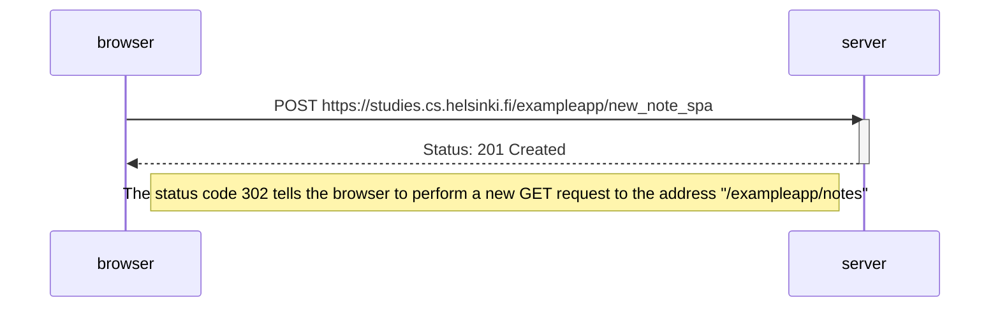

# Sequence diagram: Single Page App diagram

```mermaid
sequenceDiagram
    participant browser
    participant server

    browser->>server: POST https://studies.cs.helsinki.fi/exampleapp/new_note_spa
    activate server
    server-->>browser: Status: 201 Created
    deactivate server

    Note right of browser: The status code 302 tells the browser to perform a new GET request to the address "/exampleapp/notes"
```