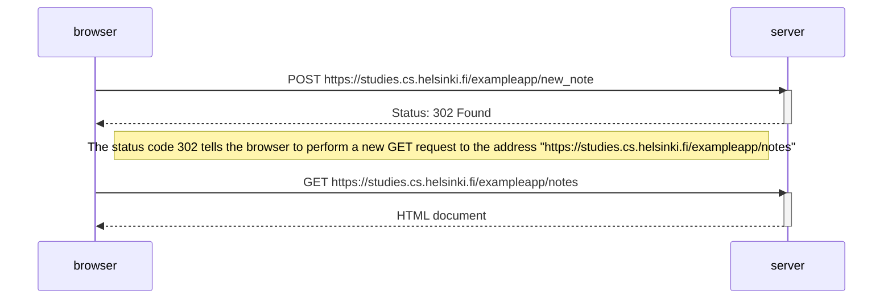

# Sequence diagram: Submitting a new note

```mermaid
sequenceDiagram
    participant browser
    participant server

    browser->>server: POST https://studies.cs.helsinki.fi/exampleapp/new_note
    activate server
    server-->>browser: Status: 302 Found
    deactivate server

    Note right of browser: The status code 302 tells the browser to perform a new GET request to the address "https://studies.cs.helsinki.fi/exampleapp/notes"

    browser->>server: GET https://studies.cs.helsinki.fi/exampleapp/notes
    activate server
    server-->>browser: HTML document
    deactivate server
```